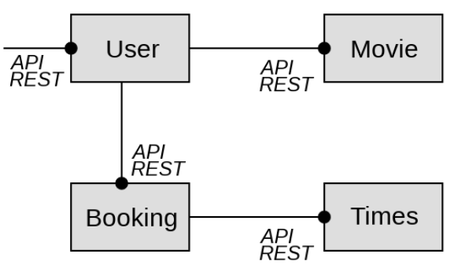
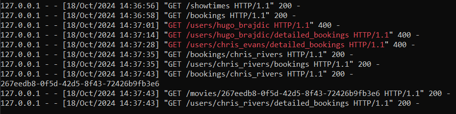
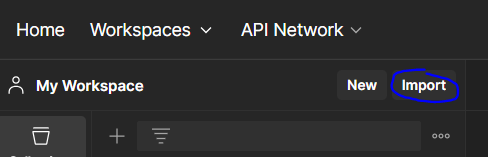
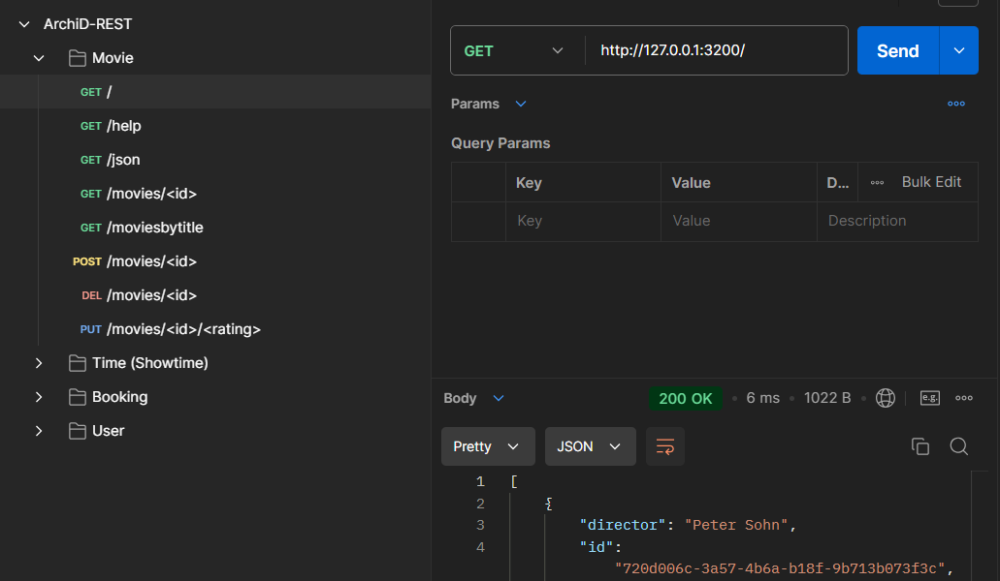

# UE-AD-A1-REST  

## Sommaire
- [Introduction](#introduction)
- [Détails des composants](#archi)
- [Lancement](#launch)
- [Test avec Postman](#postman)
- 
## Introduction <a name="introduction" />
Il s’agit d’une application jouet et peu réaliste pour gérer les films et les réservations d’utilisateurs dans un cinéma. Cette application est composée de 4 micro-services :



## Détails des composants <a name="archi" />
- 🎥 Movie : micro-service responsable de la gestion des films du cinéma. Il contient et gère une petite base de données json contenant la liste des films disponibles avec quelques informations sur les films.
```json
//Exemple de configuration pour un film
  {     
      "title": "The Good Dinosaur",
      "rating": 7.4,
      "director": "Peter Sohn",
      "id": "720d006c-3a57-4b6a-b18f-9b713b073f3c"
    } 
```
- ⏲ Times : micro-service responsable des jours de passage des films dans le cinéma. Il contient et gère une petite base de données json contenant la liste des dates avec l’ensemble des films disponibles à cette date.
```json
//Exemple d'une journée de disponibilité de films
{
      "date":"20151130",
      "movies":[
        "720d006c-3a57-4b6a-b18f-9b713b073f3c",
        "a8034f44-aee4-44cf-b32c-74cf452aaaae",
        "39ab85e5-5e8e-4dc5-afea-65dc368bd7ab"
      ]
    }
```
- 📖 Booking : micro-service responsable de la réservation des films par les utilisateurs. Il contient et gère une petite base de données json contenant une entrée par utilisateurs avec la liste des dates et films réservés. Booking fait appel à Times pour connaître et vérifier que les créneaux réservés existent bien puisqu’il ne connait pas lui même les créneaux des films.
```json
//Exemple de réservations d'un utilisateur
   {
      "userid": "chris_rivers",
      "dates": [
        {
          "date": "20151201",
          "movies": [
            "267eedb8-0f5d-42d5-8f43-72426b9fb3e6"
          ]
        }
      ]
    } 
```
- 👥 User : micro-service qui sert de point d’entrée à tout utilisateur et qui permet ensuite de récupérer des informations sur les films, sur les créneaux disponibles et de réserver. Il contient et gère une petite base de données json avec la liste des utilisateurs. User fait appel à Booking et Movie pour respectivement permettre aux utilisateurs de réserver un film ou d’obtenir des informations sur les films.
```json
//Exemple d'un utilisateur
{
      "date":"20151130",
      "movies":[
        "720d006c-3a57-4b6a-b18f-9b713b073f3c",
        "a8034f44-aee4-44cf-b32c-74cf452aaaae",
        "39ab85e5-5e8e-4dc5-afea-65dc368bd7ab"
      ]
    }
```

## Lancement <a name="launch" />
Pour lancer les 4 micro-services en simultané, il suffit de lancer le script ```launch.py``` situé à la racine du projet soit en double cliquant dessus, soit en faisant ```chemin/vers/le/projet> start ./launch.py``` dans un terminal.
> ⚠ Il est nécessaire d'avoir python d'intallé sur son poste.

Le script va d'abord lancer un environnement virtuel python puis y installer les dépendances communes qu'utilise les micro-services.

Si tout se déroule bien, vous devriez voir le mot FINISH dessiné dans la fenêtre de lancement suivie des 4 serveurs de développements des micro-services.

C'est dans cette fenêtre que vous pourrez suivre en temps réel l'utilisation de l'application et les différents appels qui sont effectués.


## Test avec Postman <a name="postman" />
Un fichier ```ArchiD-REST.postman_collection.json``` se trouve à la racine du projet.

Ce fichier JSON peut-être importé dans l'outil Postman.




Il propose pour chaque service une collection de requêtes pré-faites permettant de tester le bon fonctionnement de l'application.
> Appuyez sur Send pour exécuter une requête

 